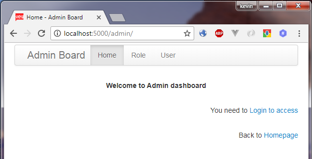

# Flask app template - Advanced

> an advanced Flask app template, integrated bunch of Flask functions/extensions for Admin, Security, blueprint, RESTful structure.

> fit for both python2 & python3

> Thanks to: Miguel Grinberg "Flask Web Development"



## Features:
- configurations in `/config.py`
- Flask_Script: manage application, deployment, command line
- Flask_sqlalchemy: powerful ORM
- Flask_Migrate: manage database, upgrade/downgrade
- Flask_Security: manage Registration/Login/Session/Token
- Flask_Admin: admin dashboard for managing database, full CURD function
- Blueprint for main and api, easy for expansion


## Install

``` bash
# git clone
# create virtual env
python3 -m venv venv
source venv/bin/activate
# install python modules
pip3 install -r requirements.txt
```

## Start up
```
# setup database
python manage.py deploy
# create roles and Admin user
python manage.py initrole
# start development server
python manage.py runserver
```
Bingo! Check app in your web browser at: http://localhost:5000, and http://localhost:5000/admin

## deploy to Heroku Server
ready for deploy to [Heroku](https://www.heroku.com), `Procfile` and `runtime.txt` are included.
```
# create app in heroku
# git push to heroku
# configure env. variables
# init database by using manage.py
```
for details, refer to: https://devcenter.heroku.com/articles/getting-started-with-python

## Expansion
For production app, you can easily expand functions as you wish, such as:
- Flask_Compress
- Flask_Cache
- Flask_Redis


> For a detailed explanation on how things work, check out the [guide (CHN)](https://www.jianshu.com/p/f37871e31231).
